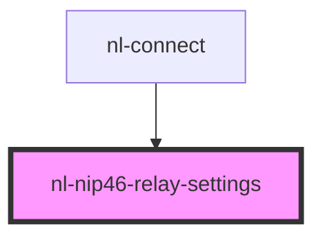

# nl-nip46-relay-settings

<!-- Auto Generated Below -->

## Properties

| Property        | Attribute | Description                           | Type       | Default                       |
| --------------- | --------- | ------------------------------------- | ---------- | ----------------------------- |
| `defaultRelays` | --        | 親から渡される現在のリレーリスト（localStorage由来の場合あり） | `string[]` | `[...FACTORY_DEFAULT_RELAYS]` |

## Events

| Event             | Description | Type                    |
| ----------------- | ----------- | ----------------------- |
| `nlRelaysChanged` |             | `CustomEvent<string[]>` |

## Dependencies

### Used by

 - [nl-connect](../nl-connect)

### Graph

----------------------------------------------

*Built with [StencilJS](https://stenciljs.com/)*
