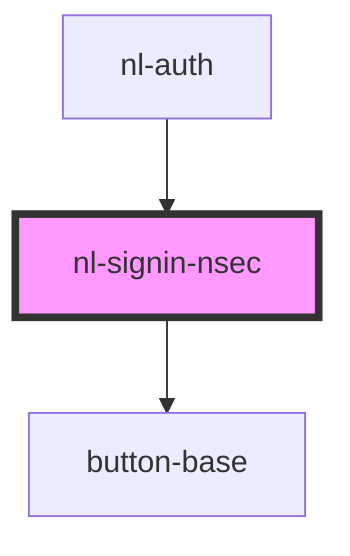

# nl-signin-nsec

<!-- Auto Generated Below -->

## Properties

| Property      | Attribute     | Description | Type     | Default                                      |
| ------------- | ------------- | ----------- | -------- | -------------------------------------------- |
| `description` | `description` |             | `string` | `'Enter your private key (nsec) to log in.'` |
| `titleLogin`  | `title-login` |             | `string` | `'Login with nsec'`                          |

## Events

| Event         | Description | Type                  |
| ------------- | ----------- | --------------------- |
| `nlLoginNsec` |             | `CustomEvent<string>` |

## Dependencies

### Used by

 - [nl-auth](../nl-auth)

### Depends on

- [button-base](../button-base)

### Graph

----------------------------------------------

*Built with [StencilJS](https://stenciljs.com/)*
